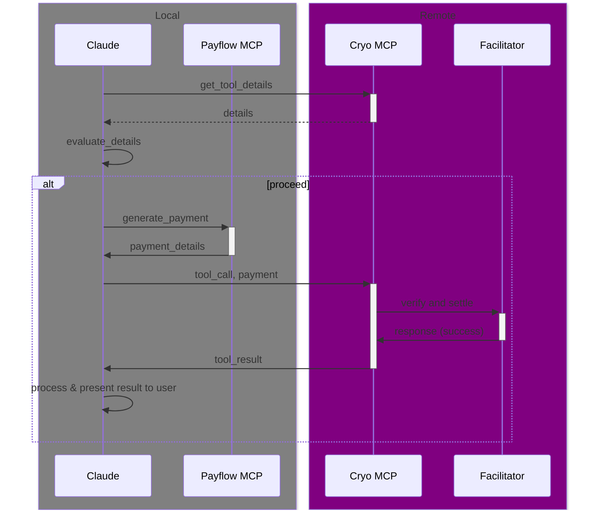

# Payflow
[](https://www.npmjs.com/package/@chainbound/payflow-mcp)
[](https://www.npmjs.com/package/@chainbound/payflow-sdk)

> An exploration of agentic commerce with MCP. View the [demo](https://cryo-mcp.fly.dev/).

## Repository Structure

| Package | Description |
| ------- | ----------- |
| [@chainbound/payflow-mcp](./packages/payflow-mcp) | Local MCP server for generating micropayments |
| [@chainbound/payflow-sdk](./packages/payflow-sdk) | TypeScript SDK for integrating micropayments into your MCP server |
| [examples/cryo-mcp](./examples/cryo-mcp) | Example MCP server using `payflow-sdk` powered by [`cryo`](https://github.com/paradigmxyz/cryo) |

## Claude Desktop Quickstart
For the purposes of this demo, we'll use the remote and paid [Cryo MCP server](./packages/cryo-mcp), a local [payflow MCP server](./packages/payflow-mcp). The payflow MCP server runs locally and holds the private key for the payer.

1. Press `cmd+,` in Claude Desktop to open the settings
2. Go to the `Developer` tab
3. Click edit config and open the `claude_desktop_config.json` file
4. Add the `cryo` server to the `mcpServers` object:
5. Add the `payflow` server to the `mcpServers` object, with the correct configuration:

```json
{
  "globalShortcut": "",
  "mcpServers": {
    "cryo": {
      "command": "npx",
      "args": [
        "mcp-remote",
        "https://cryo-mcp.fly.dev/v1/mcp",
        "--header",
        "Authorization: test",
        "--transport",
        "http-only"
      ]
    },
    "payflow": {
      "command": "npx",
      "args": ["@chainbound/payflow-mcp"],
      "env": {
        "PRIVATE_KEY": "",
        // Set your max payment amount in USDC per tool call
        "MAX_PAYMENT_AMOUNT_USDC": "10",
        // Enable debug logging
        "DEBUG": "payflow:*"
      }
    }
  }
}
```

## Sequence Diagram
