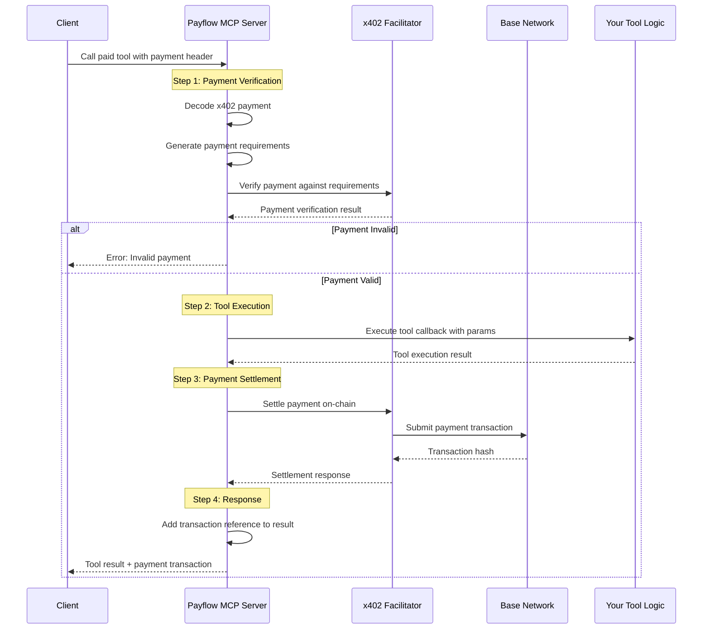

# Payflow SDK
[](https://www.npmjs.com/package/@chainbound/payflow-sdk)

The Payflow SDK is a Typescript library for building paid MCP servers using various micropayment protocols. It extends the [Model Context Protocol SDK](https://github.com/modelcontextprotocol/typescript-sdk) to provide a unified interface for building paid MCP servers.

## Features

- [x] Easy interface to register paid tools
- [x] Support for [x402](https://www.x402.org) payment schema with USDC on Base
- [ ] Support for [x402](https://www.x402.org) with other assets and networks
- [ ] Extensible payment processing (like with [Agent Commerce Kit](https://www.agentcommercekit.com/overview/introduction), Stripe, etc.)

## Installation

```bash
npm install @chainbound/payflow-sdk
# or
pnpm add @chainbound/payflow-sdk
# or
yarn add @chainbound/payflow-sdk
```

## Quick Start

### 1. Basic Setup

```typescript
import { PayflowMcpServer } from '@chainbound/payflow-sdk';
import { StdioServerTransport } from '@modelcontextprotocol/sdk/server/stdio.js';
import { z } from 'zod';

// Create a server
const server = new PayflowMcpServer({
  name: 'my-paid-server',
  version: '1.0.0',
}, {
  x402: {
    version: 1,
    keyId: process.env.CDP_API_KEY_ID,
    keySecret: process.env.CDP_API_KEY_SECRET,
  }
});

// Connect transport
const transport = new StdioServerTransport();
await server.connect(transport);
```

### 2. Register a Paid Tool

```typescript
// Simple paid tool without parameters
server.paidTool(
  'hello_world',
  'Says hello to the world',
  {
    price: 0.01,           // Price in USDC
    recipient: '0x1234...' // Ethereum address to receive payment
  },
  async () => {
    return {
      content: [{ 
        type: 'text', 
        text: 'Hello, World!' 
      }]
    };
  }
);
```

### 3. Paid Tool with Parameters

```typescript
server.paidTool(
  'generate_text',
  'Generates custom text based on input',
  {
    price: 0.05,
    recipient: '0x1234...'
  },
  {
    prompt: z.string().describe('The text prompt to generate from'),
    length: z.number().max(1000).describe('Maximum length of generated text')
  },
  async ({ prompt, length }) => {
    // Your tool logic here
    const generatedText = await someAIService.generate(prompt, length);
    
    return {
      content: [{ 
        type: 'text', 
        text: generatedText 
      }]
    };
  }
);
```

## API Reference

### `PayflowMcpServer`

Extends the standard `McpServer` with paid tool capabilities.

```typescript
const server = new PayflowMcpServer(serverInfo, options?);
```

### `paidTool()`

Register a tool that requires payment before execution.

**Signatures:**

```typescript
// Basic paid tool
paidTool(name: string, options: PaymentOptions, callback: ToolCallback)

// With description
paidTool(name: string, description: string, options: PaymentOptions, callback: ToolCallback)

// With parameters schema
paidTool<Args>(name: string, options: PaymentOptions, paramsSchema: Args, callback: ToolCallback<Args>)

// With description and parameters
paidTool<Args>(name: string, description: string, options: PaymentOptions, paramsSchema: Args, callback: ToolCallback<Args>)

// With annotations
paidTool<Args>(name: string, description: string, options: PaymentOptions, paramsSchema: Args, annotations: ToolAnnotations, callback: ToolCallback<Args>)
```

### `PaymentOptions`

Configuration for payment requirements:

```typescript
type PaymentOptions = {
  price: number;        // Price in USDC
  recipient: string;    // Ethereum address to receive payment
  asset?: string;       // Asset address (optional, defaults to USDC)
  network?: number | string; // Network (optional, defaults to Base)
}
```

## How Payments Work

1. **Client Request**: Client calls your paid tool with a `payment` parameter containing an x402 payment header
2. **Payment Verification**: SDK automatically verifies the payment against your specified requirements
3. **Tool Execution**: If payment is valid, your tool callback is executed
4. **Payment Settlement**: Payment is settled on-chain
5. **Response**: Tool result is returned with payment transaction reference



## Complete Example

```typescript
import { PayflowMcpServer } from '@chainbound/payflow-sdk';
import { StdioServerTransport } from '@modelcontextprotocol/sdk/server/stdio.js';
import { z } from 'zod';

const server = new PayflowMcpServer({
  name: 'weather-server',
  version: '1.0.0',
});

// Free tool (standard MCP)
server.tool(
  'get_weather_info',
  'Get general weather information',
  async () => ({
    content: [{ 
      type: 'text', 
      text: 'Weather service available. Use get_weather for specific locations.' 
    }]
  })
);

// Paid tool for detailed weather
server.paidTool(
  'get_weather',
  'Get detailed weather for a specific location',
  {
    price: 0.02,
    recipient: '0x742d35Cc6634C0532925a3b8D1d3e14C1C3E6FC8' // Your wallet address
  },
  {
    location: z.string().describe('City name or coordinates'),
    units: z.enum(['metric', 'imperial']).optional().describe('Temperature units')
  },
  async ({ location, units = 'metric' }) => {
    // Call your weather API
    const weather = await weatherAPI.getWeather(location, units);
    
    return {
      content: [{ 
        type: 'text', 
        text: `Weather in ${location}: ${weather.temperature}°${units === 'metric' ? 'C' : 'F'}, ${weather.condition}` 
      }]
    };
  }
);

// Start server
const transport = new StdioServerTransport();
await server.connect(transport);
```

## Environment Setup

Your MCP server should handle these environment variables:

```bash
CDP_API_KEY_ID=your-api-key-id
CDP_API_KEY_SECRET=your-api-key-secret
```

## Client Usage

Clients need to provide payment headers when calling paid tools. The payment header should be generated using the x402 protocol with your specified price and recipient.

## License

MIT
